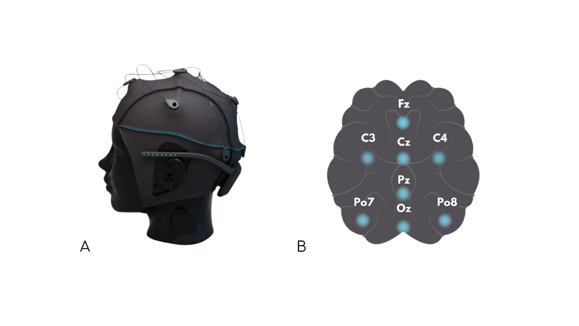

# Introduction and Dataset Description
This repository includes a complex systems approach to data analysis. 
The dataset used was collected by the authors in collaboration with another student during experiments conducted at Tilburg University in fall 2022.
The dataset contains EEG data from 40 participants, divided in two conditions. It was a within-participant study, so for each participant data from both conditions are available. Every datafile includes EEG data from 8 channels (Fz, C3, Cz, C4, Pz, PO7, Oz, PO8) with the international 10/20 placement (see the figure below: A. electrode placement and B. the Unicorn Hybrid Black EEG headset by g.tec Medical Engineering) collected during a 10 minute listening task. The conditions refer to the experimental setup of the study, where participants heard two different sets of medical information with the same length from a social robot. In the Adaptice condition, the robot tried to re-engage participants with a gesture when they seemed to not be focused according to EEG activity and in the randm condition the robot performed gestures at random intervals. Further information about the experiment and data collection can be found in [this paper](https://dl.acm.org/doi/abs/10.1145/3568294.3580110).

# Data Preprocessing
The data was collected through Matlab Simulink, therefore it was initially stored in .mat files. The files have been first converted into .csv and then to .fif to be able to work with the mne module for python. After a first inspection of the data, we noticed that it was very noisy, and we decided it would be better to preprocess it through EEGLAB, to make sure we could get a clear idea of the steps that were applied. 
Our preprocessing pipeline consisted in
1) Loading the data (already notch-filtered at 50 Hz)
2) Applying a bandpass filter of 0.5-30 Hz. We decided to cut out the higher frequencies because muscular movement is often highly reflected in gamma.
3) Changing the sampling rate. This was necessary for the next step. The sampling rate of the headset used was 250, which was changed to 256.
4) Applying Artifact Subspace Reconstruction (ASR) over all channels to reject data. ASR is an effective method for removing artifacts from EEG data. It uses principal component analysis (PCA) to identify and reject data contaminated by artifacts such as eye blinks, eye movements, and muscle activity. During this step, some channels were removed and then automatically reconstructed.

After these steps, we continued our analysis of the data in python. We calculated power spectral density applying the welch method in order to extract data from the alpha, beta and theta power bands for each participant. These powerbands were needed to calculate the EEG engagement index, which we have used as measure of engagement in the experiments. The data about the EEG engagement index over time was then stored in separate csv files (one for each participant, for each condition) in order to be used for further analysis in R. 

# Alternative data processing
For some analyses the same data has been formatted in a different way. Epochs of EEG data based on when certain information were given in the story telling task were extracted, and the score in the final test relative to that information was stored. This type of formatting allows for a better analysis over time and for a possible comparison between EEG data and recall test scores, which provide a measure for whether participants were storing the information to memory during a given epoch of EEG data.

# Portfolio Entries

## [Entry 1 - Temporal Dynamics of the EEG Engagement Index ](Portfolio%20Entries%20(pdf)/Temporal%20Dynamics.pdf)
This entry investigates the temporal signature as well as stationarity of the EEG Engagement Index over time.

The following questions are adressed: 

- Section 1: What are the temporal signatures of the signal?
- Section 2: Are the EEG Engagement Index time series stationary?
- Section 3: Does autocorrelation, as measured by ACF peaks, change over time?

## [Entry 2 - Phase Space Reconstruction](Portfolio%20Entries%20(pdf)/PhaseSpaceReconstruction.pdf)
This entry focuses on Phase Space Reconstruction for EEG data in different epochs.
An extensive analysis on how to calculate tau and embedding dimension is done, which lays the groundwork for future analyses.

## [Entry 3 - Recurrence Quantification Analysis](Portfolio%20Entries%20(pdf)/RecurrenceQuantificationAnalysis.pdf)
This entry explores Recurrence Quantification analysis for EEG data over different epochs.

The following methods are explored:
- RQA of the average over channels, for each epoch
- CRQA of the average channels for 4 pairs of epochs
- mdCRQA of all the channels for 4 pairs of epochs

## [Entry 4 - Empirical Dynamic Modeling](Portfolio%20Entries%20(pdf)/Empirical_Dynamic_Modeling.pdf)
This entry applied empirical dynamic modeling analysis to raw (cleaned) EEG data and recall test scores in order to explore whether there is a non-linear connection between EEG data in a given time window and whether the participant remembered information they were told in that time window.

The following questions are adressed: 

- Are the raw EEG data and recall score time series stationary? 
- What is the optimal embedding dimension for our EEG data?
- How does increasing tp (time points in the future for prediction) affect simplex projection results for EEG data?
- What does convergent cross mapping indicate about the relationship between EEG data and recall in our experiment? 

## [Entry 5 - Correlation in EEG Data](Portfolio%20Entries%20(code)/Correlation_in_EEG_Data.ipynb)
This entry investigates coordination (also known as functional connectivity in neuroscience literature) between brain regions using EEG Data and phase synchrony metrics. 

The following questions are addressed:

- Is there a difference in connectivity between electrodes based on the experiment condition?
- Does the metric of phase synchrony we choose affect whether there is a significant difference or not?
- Does connectivity look different in different frequency bands or in different regional groupings?

## [Entry 6 - Fractals](Portfolio%20Entries%20(pdf)/Fractals.pdf)
In the fractal module, we focused on understanding and analyzing fractal patterns in data. We explored multifractal behavior using Multifractal Detrended Fluctuation Analysis (MFDFA) and extracted meaningful metrics from the data.

We discovered that the data exhibits scale-free or power-law behavior, indicating complex underlying structures with long-range correlations and self-similarity. By applying MFDFA, we identified multifractal behavior, revealing a wide range of statistical properties across different scales.

We also explored various metrics derived from MFDFA, providing insights into the data's variability and statistical properties. These metrics enhanced our understanding of the data's complexity and allowed us to quantify its dynamics.

Overall, the fractal module deepened our understanding of fractal patterns and equipped us with tools to analyze and interpret complex data, contributing to broader research in this field.

## [Entry 7 - Entropy](Portfolio%20Entries%20(pdf)/)
This exploration delves into the realm of entropy analysis, covering Shannon Entropy, Sample Entropy, the impact of different embedding dimensions (Edim), and the correlation between Sample Entropy and MFDFA. Shannon Entropy measures uncertainty in a probability distribution, while Sample Entropy captures complexity in time series data. Analyzing Sample Entropy across different Edim values highlights the importance of choosing the right embedding dimension. Furthermore, investigating the correlation between Sample Entropy and MFDFA reveals potential connections between entropy dynamics and scaling properties. This exploration deepens our understanding of entropy analysis and its application in unraveling patterns and relationships in complex datasets.

_This material was initially created as part of Travis J. Wiltshire's Complex Systems Methods for Cognitive and Data Scientists course at Tilburg University._

